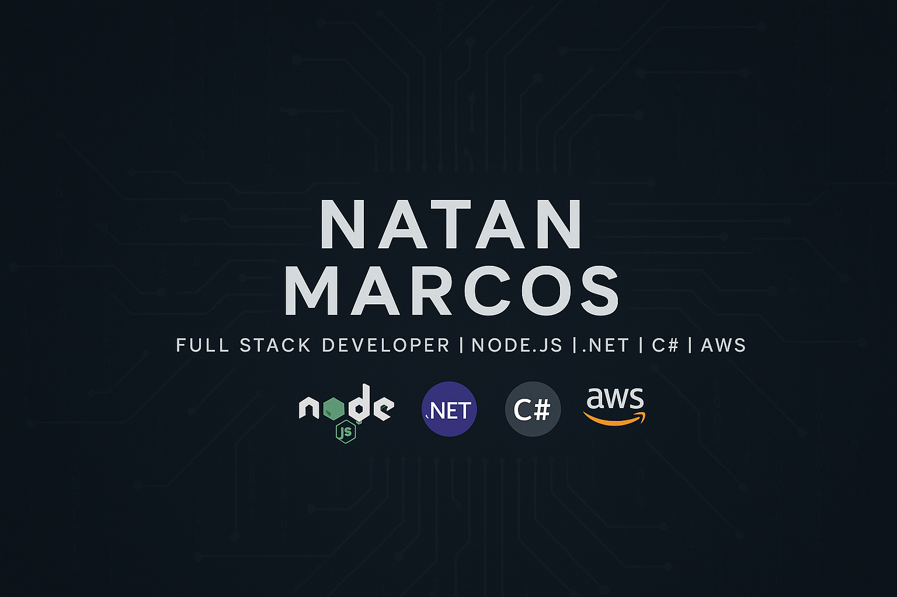

# 👋 Olá, eu sou o Natan Marcos

🎓 Estudante de Análise e Desenvolvimento de Sistemas na Estácio  
💻 Desenvolvedor **Full Stack** com foco em **Node.js** e **.NET (C#)**  
🔁 Experiência com **REST APIs**, **bancos de dados SQL**, e **ambientes em nuvem (AWS)**  
🎮 Criador de jogos 2D e entusiasta de sistemas backend robustos

---

## 💻 Tecnologias & Ferramentas

**Linguagens & Frameworks:**

**Banco de Dados & Cloud:**

**Ferramentas:**

---

## 📈 GitHub Stats

---

## 📫 Contato

---

✨ Sempre aprendendo, sempre construindo.
